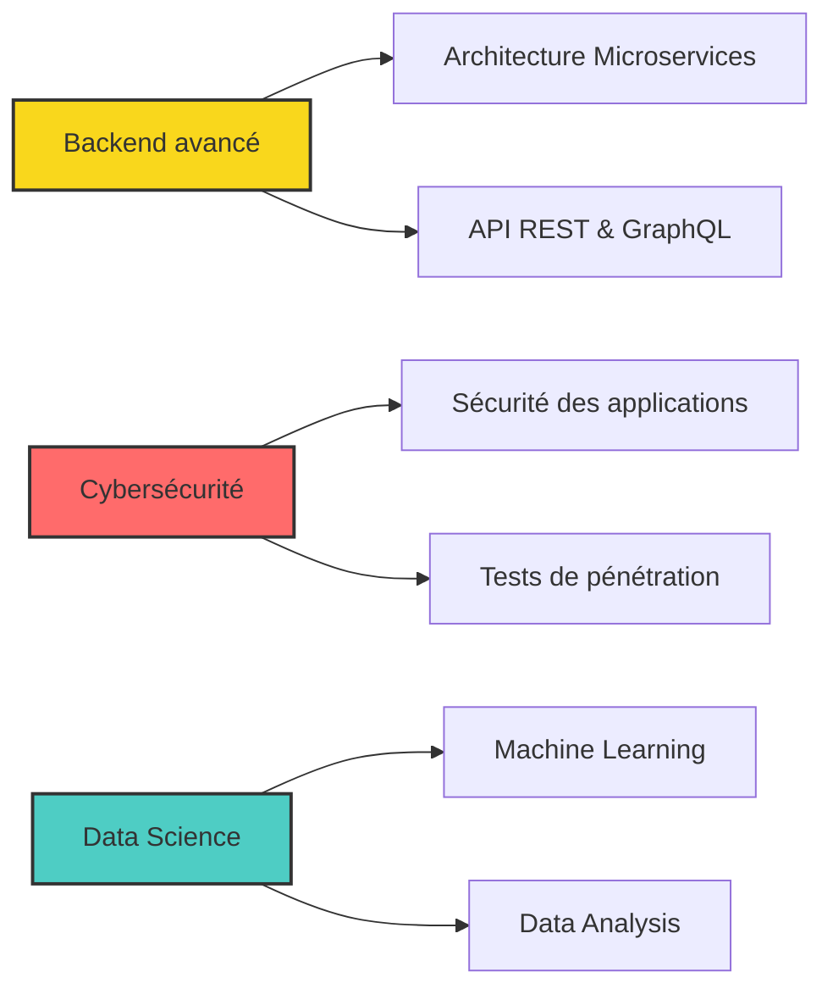

<div align="center">
  
# 👋 Salut, moi c'est Yasmine Meité

### 💫 Développeuse FullStack & Mobile passionnée par l'innovation


[](https://github.com/yasminemei)
[](https://linkedin.com/in/yasmine-meite)
[](mailto:meiteyasmine90@gmail.com)

</div>

---

## 🚀 À propos de moi

```typescript
const yasmine = {
    role: "FullStack & Mobile Developer",
    company: "Topeci",
    location: "🌍",
    currentFocus: ["Backend Development", "Cybersécurité", "Data Science"],
    collaborations: ["Eniazou Medical System"],
    languages: ["JavaScript", "TypeScript", "Python", "Java", "C++", "C#"],
    askMeAbout: ["Web Dev", "Mobile Dev", "Tech", "Innovation"],
    technologies: {
        frontend: {
            js: ["React", "Vue.js", "React Native"],
            css: ["Tailwind CSS", "CSS3", "HTML5"]
        },
        backend: {
            js: ["Node.js", "Express"],
            python: ["Django"]
        },
        mobile: ["Flutter", "React Native", "Android"],
        databases: ["MongoDB", "MySQL", "PostgreSQL", "Oracle"],
        tools: ["Git", "Postman", "Linux"]
    },
    architecture: ["SPA", "REST API", "Microservices"],
    currentlyLearning: "Backend avancé, sécurité des applications & data science",
    funFact: "Je transforme le café en code ! ☕️ → 💻"
};
```

---

## 💼 Expérience Professionnelle

<table>
<tr>
<td width="50%">

### 🏢 Topeci
**Développeuse FullStack & Mobile**

- 🔨 Développement d'applications web et mobile
- 🎨 Création d'interfaces utilisateur modernes
- 🔧 Maintenance et amélioration continue

</td>
<td width="50%">

### 🏥 Eniazou Medical System
**Collaboratrice**

- 👥 Contribution à un système médical innovant
- 🤝 Travail en équipe sur des projets d'envergure
- 📱 Développement de solutions healthcare

</td>
</tr>
</table>

---

## 🛠️ Stack Technique

<div align="center">

### Frontend


### Backend


### Mobile


### Databases


### Languages


### Tools & Others


</div>

---

## 📊 Statistiques GitHub

<div align="center">
  


</div>

---

## 🏆 Réalisations GitHub

<div align="center">

[](https://github.com/ryo-ma/github-profile-trophy)

</div>

---

## 🎯 Actuellement en train d'explorer



---

## 🌟 Projets Phares

<div align="center">

| Projet | Description | Technologies |
|:---:|:---:|:---:|
| 🏥 **Eniazou Medical System** | Système de gestion médicale | React, Node.js, MongoDB |
| 💼 **Projets Topeci** | Applications d'entreprise | FullStack & Mobile |
| 🚀 **En développement** | Nouveaux projets innovants | À venir... |

</div>

---

## 📈 Contribution Graph

<div align="center">


[](https://github.com/yasminemei)

</div>

---

## 💡 Citation du jour

<div align="center">

[](https://github.com/piyushsuthar/github-readme-quotes)

</div>

---

## 🤝 Connectons-nous !

<div align="center">

[](https://linkedin.com/in/yasmine-meite)
[](https://fb.com/yasmine-meite)
[](https://instagram.com/mye097)
[](mailto:meiteyasmine90@gmail.com)

### 💬 *"Le code est de la poésie, chaque ligne raconte une histoire"*

---


**Merci pour votre visite ! N'hésitez pas à explorer mes projets et à me contacter 🚀**

⭐️ Si mes projets vous plaisent, n'hésitez pas à laisser une étoile !

</div>
