  
# 👋 Salut, moi c'est Yasmine Meité

### 💫 Développeuse FullStack & Mobile passionnée par l'innovation

---

## 🚀 À propos de moi

BSc in Software Engineering and Information Systems | Full-Stack Web & Mobile Developer
---

## 💼 Expérience Professionnelle

<table>
<tr>
<td width="50%">

### 🏢 Topeci
**Développeuse FullStack & Mobile**

- 🔨 Développement d'applications web et mobile
- 🎨 Création d'interfaces utilisateur modernes
- 🔧 Maintenance et amélioration continue

</td>
<td width="50%">

### 🏥 Eniazou Medical System
**Collaboratrice**

- 👥 Contribution à un système médical innovant
- 🤝 Travail en équipe sur des projets d'envergure
- 📱 Développement de solutions healthcare

</td>
</tr>
</table>

---

## 🛠️ Stack Technique

### Frontend

### Backend

### Mobile

### Databases

### Languages

### Tools & Others

---

## 📊 Statistiques GitHub

  

---

## 🏆 Réalisations GitHub

---

## 🎯 Actuellement en train d'explorer

```mermaid
graph LR
    A[Backend avancé] --> B[Architecture Microservices]
    A --> C[API REST & GraphQL]
    D[Cybersécurité] --> E[Sécurité des applications]
    D --> F[Tests de pénétration]
    G[Data Science] --> H[Machine Learning]
    G --> I[Data Analysis]
    
    style A fill:#f9d71c,stroke:#333,stroke-width:2px
    style D fill:#ff6b6b,stroke:#333,stroke-width:2px
    style G fill:#4ecdc4,stroke:#333,stroke-width:2px
```

---

## 🌟 Projets Phares

| Projet | Description | Technologies |
|:---:|:---:|:---:|
| 🏥 **Eniazou Medical System** | Système de gestion médicale | React, Node.js, MongoDB |
| 💼 **Projets Topeci** | Applications d'entreprise | FullStack & Mobile |
| 🚀 **En développement** | Nouveaux projets innovants | À venir... |

---

## 📈 Contribution Graph

---

## 💡 Citation du jour

---

## 🤝 Connectons-nous !

### 💬 *"Le code est de la poésie, chaque ligne raconte une histoire"*

---

**Merci pour votre visite ! N'hésitez pas à explorer mes projets et à me contacter 🚀**

⭐️ Si mes projets vous plaisent, n'hésitez pas à laisser une étoile !

